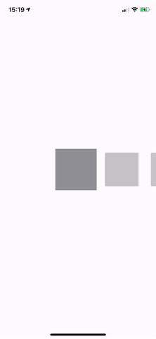

# SDCenteredScrollView

[](https://cocoapods.org/pods/SDCenteredScrollView)
[](https://cocoapods.org/pods/SDCenteredScrollView)
[](https://cocoapods.org/pods/SDCenteredScrollView)


## Example



## Requirements
This pod requires a deployment target of iOS 9.0 or greater

## Installation

SDCenteredScrollView is available through [CocoaPods](https://cocoapods.org). To install
it, simply add the following line to your Podfile:

```ruby
pod 'SDCenteredScrollView'
```
## Programmatic Usage
```Swift
    import SDCenteredScrollView
```
```Swift
    private var collectionView: UICollectionView = {
        
        let flowLayout = SDCenteredCollectionViewLayout()
        flowLayout.scrollDirection = .horizontal
        flowLayout.itemSize = CGSize(width: 100, height: 100)
        
        flowLayout.minimumLineSpacing = 10//default = 10
        flowLayout.standardItemAlpha = 0.5//default = 1
        flowLayout.standardItemScale = 0.8//defaul = 1
        
        let collectionView = UICollectionView(frame: CGRect.zero, collectionViewLayout: flowLayout)
        collectionView.backgroundColor = .clear
        collectionView.showsHorizontalScrollIndicator = false
        collectionView.showsVerticalScrollIndicator = false
        collectionView.register(UICollectionViewCell.self, forCellWithReuseIdentifier: "cell")
        collectionView.translatesAutoresizingMaskIntoConstraints = false
        return collectionView
    }()
```
```Swift
    extension ViewController: UICollectionViewDelegateFlowLayout{
      func collectionView(_ collectionView: UICollectionView, layout collectionViewLayout: UICollectionViewLayout, insetForSectionAt section: Int) -> UIEdgeInsets {
      
      let leftEdgeInsets = collectionView.frame.size.width / 2 - ((self.cardSize.width) / 2)
      let rightEdgeInsets = collectionView.frame.size.width / 2 - ((self.cardSize.width) / 2)
        
      return UIEdgeInsets(top: 0, left: leftEdgeInsets, bottom: 0, right: rightEdgeInsets);
    }
```

## Author

William Yeung, william.yeung@relaxops.com

## License

SDCenteredScrollView is available under the MIT license. See the LICENSE file for more info.
